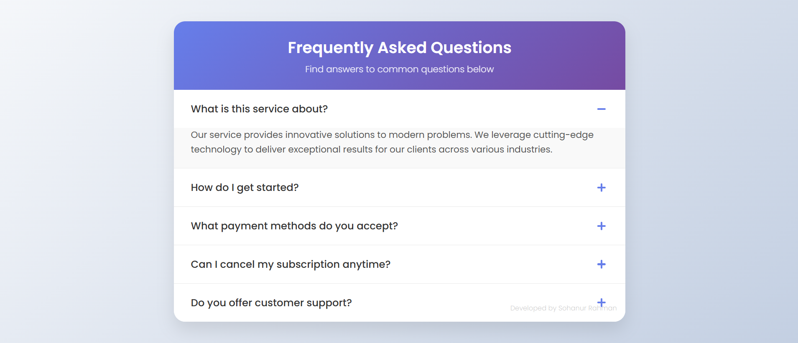

# Modern Accordion (FAQ) Component

# Overview

This Modern Accordion Component is a sleek, responsive solution for creating FAQ sections, collapsible content panels, and expandable information displays. Built with pure HTML, CSS, and JavaScript (no dependencies), this component features smooth animations, accessibility best practices, and easy customization options.

# Key Highlights:

🎨 Visually appealing gradient design with modern UI elements  
⚡ Lightning-fast performance with vanilla JavaScript  
📱 Fully responsive across all device sizes  
♿ Built with accessibility in mind  
🛠️ Easy to implement and customize

# Table of Contents

- Features  
- Installation  
- Usage  
- Customization  
- Accessibility  
- Browser Support  
- Performance  
- Contributing  
- License  
- Support

# Features 

## Core Functionality

- Smooth expand/collapse animations  
- Single-item open mode (can be configured for multiple)  
- Auto-closes other items when opening a new one  
- First item opens by default  
- Clean plus/minus toggle indicators

## Design Elements

- Gradient header with customizable colors  
- Subtle hover effects  
- Proper spacing and typography  
- Elegant borders and shadows  
- Responsive padding and margins

## Technical Features

- Pure vanilla JavaScript (no jQuery or other dependencies)  
- CSS transitions for smooth animations  
- Semantic HTML structure  
- Mobile-first design approach  
- Lightweight (under 10KB total)

# Developer

Developed by : Sohanur Rahman
